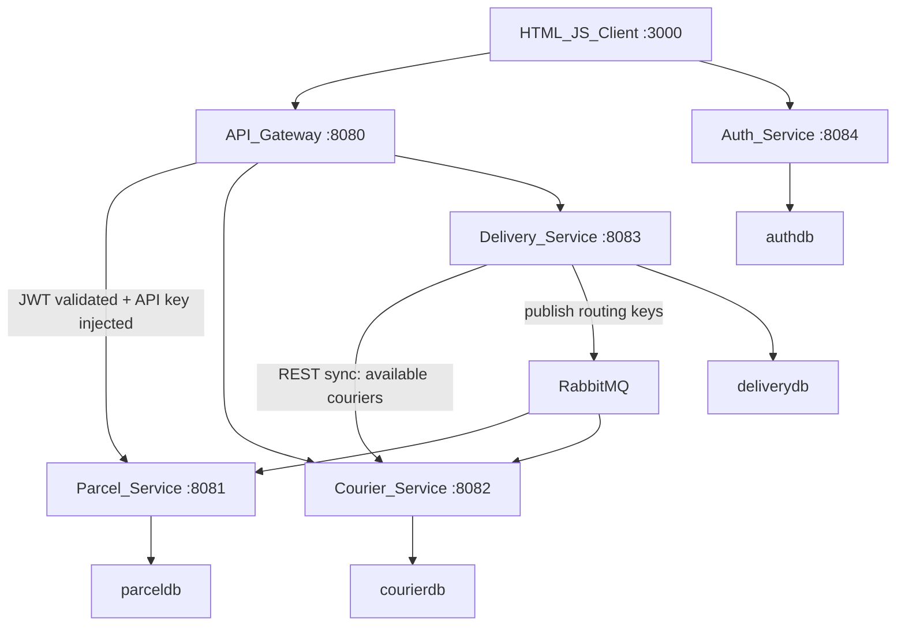

# Parcel Delivery System

Monorepo for a service-oriented parcel delivery demo: plain HTML/JS client, Spring Cloud Gateway, JWT auth, three domain microservices, MySQL, RabbitMQ, and Redis.

## Architecture



Shared ports, headers, RabbitMQ names, and package prefixes are documented in [`CONVENTIONS.md`](CONVENTIONS.md).

## Quick start

**Prerequisites:** Docker Desktop (or Docker Engine + Compose v2).

```bash
docker compose up --build
```

| URL | Purpose |
|-----|---------|
| http://localhost:3000 | Client UI |
| http://localhost:8080 | API Gateway |
| http://localhost:15672 | RabbitMQ management (`guest` / `guest`) |

Optional local overrides: copy [`.env.example`](.env.example) to `.env`.

First boot can take a few minutes while images build and MySQL/services become healthy.

## Demo credentials & seed data

| What | Value |
|------|--------|
| OAuth demo user | `admin` / `password` (seeded by `auth-service`) |
| Demo parcels | 2 × `PENDING` (seeded when `parceldb` is empty) |
| Demo couriers | Available in `Colombo` (×2) and `Kandy` (×1) |

Assign a delivery with area `Colombo` (or `Kandy`) against a seeded parcel id to exercise the happy path immediately.

## Swagger / OpenAPI

Each domain service exposes springdoc UI (requires the service API key in Swagger’s Authorize dialog when calling secured endpoints):

| Service | Swagger UI |
|---------|------------|
| Parcel | http://localhost:8081/swagger-ui.html |
| Courier | http://localhost:8082/swagger-ui.html |
| Delivery | http://localhost:8083/swagger-ui.html |
| Auth | http://localhost:8084/swagger-ui.html |

Prefer the **Gateway** (`:8080`) for end-to-end calls with a Bearer JWT. Direct service ports are for local debugging and proving API-key rejection.

## API keys (direct microservice calls)

Header name: `X-API-KEY`. The gateway injects the correct key when proxying and strips any client-supplied value.

| Service | Default key |
|---------|-------------|
| Parcel | `parcel-service-key` |
| Courier | `courier-service-key` |
| Delivery | `delivery-service-key` |
| Auth | `auth-service-key` |

Calling a service without a valid key returns **401**. Clients should never send service keys; obtain a JWT and call the gateway only.

## Example curl flows (via Gateway)

### 1. Login → JWT

```bash
TOKEN=$(curl -s -X POST http://localhost:8080/auth/login \
  -H "Content-Type: application/json" \
  -d '{"username":"admin","password":"password"}' \
  | jq -r .accessToken)
```

### 2. List seeded parcels & couriers

```bash
curl -s http://localhost:8080/api/parcels -H "Authorization: Bearer $TOKEN" | jq
curl -s "http://localhost:8080/api/couriers/available?area=Colombo" \
  -H "Authorization: Bearer $TOKEN" | jq
```

### 3. Assign → pickup → complete

```bash
# Use a PENDING parcel id from the list (e.g. 1)
DELIVERY=$(curl -s -X POST http://localhost:8080/api/deliveries/assign \
  -H "Authorization: Bearer $TOKEN" \
  -H "Content-Type: application/json" \
  -d '{"parcelId":1,"area":"Colombo"}')
echo "$DELIVERY" | jq
DELIVERY_ID=$(echo "$DELIVERY" | jq -r .id)

curl -s -X PUT "http://localhost:8080/api/deliveries/$DELIVERY_ID/pickup" \
  -H "Authorization: Bearer $TOKEN" | jq

curl -s -X PUT "http://localhost:8080/api/deliveries/$DELIVERY_ID/complete" \
  -H "Authorization: Bearer $TOKEN" | jq
```

### 4. Verify async side effects

```bash
# Parcel should be DELIVERED after RabbitMQ consumers process events
curl -s http://localhost:8080/api/parcels/1/status -H "Authorization: Bearer $TOKEN" | jq

# Assigned courier becomes unavailable on assign; available again after complete
curl -s http://localhost:8080/api/couriers -H "Authorization: Bearer $TOKEN" | jq

# Track by parcel id
curl -s http://localhost:8080/api/deliveries/track/1 -H "Authorization: Bearer $TOKEN" | jq
```

### 5. Prove direct unauthorized access is blocked

```bash
# Missing API key → 401
curl -s -o /dev/null -w "%{http_code}\n" http://localhost:8081/api/parcels
```

### Create resources (optional)

```bash
curl -s -X POST http://localhost:8080/api/parcels \
  -H "Authorization: Bearer $TOKEN" \
  -H "Content-Type: application/json" \
  -d '{
    "senderName":"Ada",
    "senderAddress":"1 Main St",
    "receiverName":"Bob",
    "receiverAddress":"2 High St",
    "weight":3.0
  }' | jq

curl -s -X POST http://localhost:8080/api/couriers \
  -H "Authorization: Bearer $TOKEN" \
  -H "Content-Type: application/json" \
  -d '{
    "name":"Nisha",
    "phone":"+94770001122",
    "vehicleType":"Motorcycle",
    "currentArea":"Colombo",
    "isAvailable":true
  }' | jq
```

## Smoke test checklist

Use after `docker compose up --build` when all healthchecks are green.

- [ ] **Compose up** — `docker compose ps` shows mysql, rabbitmq, redis, auth, parcel, courier, delivery, gateway, client healthy/running
- [ ] **Client loads** — open http://localhost:3000
- [ ] **Login** — `admin` / `password` succeeds; JWT stored (UI) or returned (curl)
- [ ] **Register** (optional) — new user can register and login
- [ ] **List parcels** — seeded parcels visible via UI or `GET /api/parcels`
- [ ] **List / available couriers** — at least one available in `Colombo`
- [ ] **Assign delivery** — `POST /api/deliveries/assign` with `{ "parcelId": <id>, "area": "Colombo" }` → status `ASSIGNED`
- [ ] **Parcel status after assign** — parcel becomes `ASSIGNED` (allow a short delay for RabbitMQ)
- [ ] **Courier availability after assign** — assigned courier `isAvailable=false`
- [ ] **Pickup** — `PUT /api/deliveries/{id}/pickup` → delivery `PICKED_UP`, parcel `IN_TRANSIT`
- [ ] **Complete** — `PUT /api/deliveries/{id}/complete` → delivery `DELIVERED`, parcel `DELIVERED`
- [ ] **Courier freed** — courier `isAvailable=true` again
- [ ] **Track** — `GET /api/deliveries/track/{parcelId}` returns the delivery
- [ ] **Security** — direct call to `:8081` without `X-API-KEY` → 401; `/api/**` without Bearer JWT via gateway → 401
- [ ] **CORS** — browser client on `:3000` can call gateway without CORS errors
- [ ] **Swagger** — each service Swagger UI loads on 8081–8084

## Project layout

```
├── docker-compose.yml
├── mysql-init/init.sql
├── CONVENTIONS.md
├── gateway/           # Spring Cloud Gateway :8080
├── auth-service/      # JWT register/login :8084
├── parcel-service/    # Parcel CRUD + status consumer :8081
├── courier-service/   # Courier CRUD + availability consumer :8082
├── delivery-service/  # Orchestrator (assign/pickup/complete/track) :8083
└── client/            # Plain HTML/JS + Nginx :3000
```

## Messaging contract

| Item | Value |
|------|--------|
| Exchange | `delivery.exchange` (topic) |
| Routing keys | `parcel.assigned`, `parcel.pickedup`, `parcel.delivered` |
| Queues | `parcel.status.queue`, `courier.availability.queue` |

**Happy path:** Delivery assigns via REST to Courier → publishes `parcel.assigned` → Parcel status `ASSIGNED`, Courier unavailable → pickup publishes `parcel.pickedup` → Parcel `IN_TRANSIT` → complete publishes `parcel.delivered` → Parcel `DELIVERED`, Courier available again.

## Report outline & contribution matrix

Suggested report sections (maps to the coursework brief):

1. **Architecture** — diagram above; sync (Delivery→Courier REST) vs async (RabbitMQ) rationale; Docker DNS instead of Eureka.
2. **Per-service breakdown** — Parcel / Courier / Delivery endpoints, entities, consumers/producers.
3. **Security** — OAuth2 JWT (auth + gateway resource server), per-service `X-API-KEY`, CORS, rate limiting (Redis `RequestRateLimiter`).
4. **Client** — screenshots of login, parcels, couriers, assign/pickup/complete, track.
5. **Verification** — smoke checklist results and example curl transcript.
6. **Contribution matrix** — fill names for your group:

| Area | Owner (fill in) | Notes |
|------|-----------------|--------|
| **Member 1 — Parcel Service** | | CRUD under `/api/parcels`; consumer on `parcel.status.queue`; API key + Swagger + Dockerfile |
| **Member 2 — Courier Service** | | CRUD + availability; consumer on `courier.availability.queue`; API key + Swagger + Dockerfile |
| **Member 3 — Delivery Service** | | Assign / pickup / complete / track; RestClient → Courier; RabbitMQ producer; API key + Swagger + Dockerfile |
| **Gateway lead** (Member 1 or shared) | | `gateway/`, `auth-service/`, root Docker Compose, CORS, rate limit, API-key injection |
| **Client** (shared or Gateway lead) | | Plain HTML/JS demo of all three domains via Gateway only |
| **Docs / demo polish** | | README, seed data, smoke checklist, report matrix |

Out of scope for v1 (document as intentional): Eureka/K8s, mobile client, full saga compensation.
